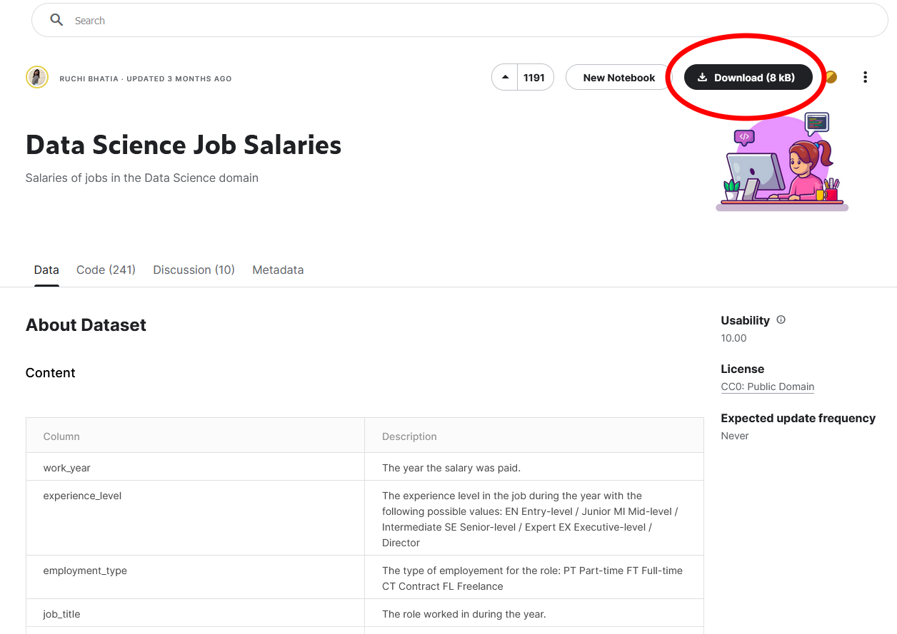

# DE_Sprint

## Практическая работа №4. Обработка данных в Python. Библиотека Pandas

Перевести спарсенный JSON в формат CSV таблицу с помощью Pandas

Для hh.ru:

-	Сгруппируйте вакансии по направлениями (DS, DE, Software Engenering, etc.)
-	Какая средняя и медианная зарплата по группам вакансий?
-	Какая средняя и медианная зарплата по каждому региону?
-	Какая самая высокооплачиваемая из групп вакансий, исходя из их средних зарплат?
-	Какое процентное соотношение каждого региона по вакансиям от всех вакансий?
-	Какая корреляция уровня опыта от зарплаты?
-	Сколько должностей в наборе данных?
-	Какие 10 наиболее часто встречающихся должностей?

Все то же и для датасета kaggle.

## Файлы и полезные ресурсы

### Kaggle

* [data-science-job-salaries](https://www.kaggle.com/datasets/ruchi798/data-science-job-salaries)

Для того, чтобы скачать датасет, необходимо зарегистрироваться на платформе и потом нажать на кнопку 

### Датасет Kaggle:

* [ds_salaries](./ds_salaries.csv)

### Датасет hh.ru вакансий:

* [data](./data_01102022.json)

## Файлы формата ".ipynb"

### Анализ датасета вакансий hh.ru:

* [main_1.ipynb](./main_1.ipynb)

#### Преобразованный JSON в CSV:

* [result.csv](./result.csv)

### Анализ датасета Kaggle:

* [main_2.ipynb](./main_2.ipynb)

## Зависимости

-	См. [req.txt](./req.txt)