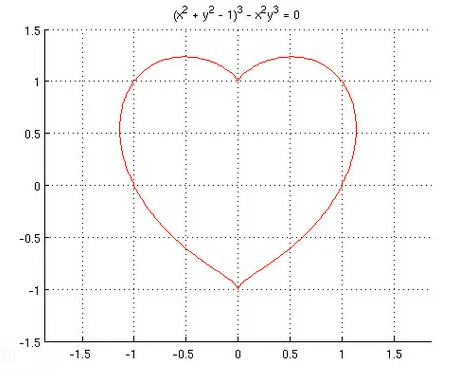
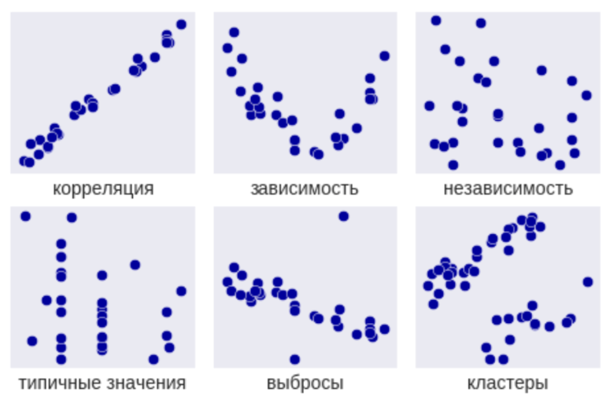

# DE_Sprint

## Практическая работа №3. Использование библиотек NumPy, SciPy

##  1. Построение распределений 

Сгенерировать выборку для распределения Рэлея ( https://ru.wikipedia.org/wiki/Распределение_Рэлея ) используя NumPy и SciPy и построить на ее основе кривую плотности распределения, используя гистограмму из Matplotlib. 

## 2. Построение графика по функции 

Сгенерировать массивы для функции (x^2 + y^2 - 1)^3 - x^2 y^3 = 0 и построить на их основе график. 

Примерный график: 

## 3. Анализ зависимостей

Найти в датасете, приложенном к заданию, зависимости.

Виды зависимостей: 

## Файлы

### Датасет

* [dataset_home](./dataset_home.txt)

### Файл формата ".ipynb"

* [main](./main.ipynb)

## Зависимости

-	См. [req](./req.txt)