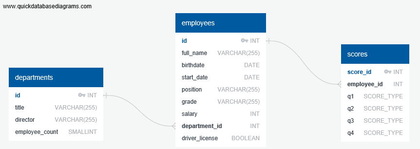

# DE_Sprint

## Практическая работа №9. Реляционные базы данных: PostgreSQL

Глобальная задача – создать БД сотрудников компании.

Для этого нам необходимо:

1. Создать таблицу с основной информацией о сотрудниках: ФИО, дата рождения, дата начала работы, должность, уровень сотрудника (jun, middle, senior, lead), уровень зарплаты, идентификатор отдела, наличие/отсутствие прав(True/False). При этом в таблице обязательно должен быть уникальный номер для каждого сотрудника.

2. Для будущих отчетов аналитики попросили вас создать еще одну таблицу с информацией по отделам – в таблице должен быть идентификатор для каждого отдела, название отдела (например. Бухгалтерский или IT отдел), ФИО руководителя и количество сотрудников.

3. На кону конец года и необходимо выплачивать сотрудникам премию. Премия будет выплачиваться по совокупным оценкам, которые сотрудники получают в каждом квартале года. Создайте таблицу, в которой для каждого сотрудника будут его оценки за каждый квартал. Диапазон оценок от A – самая высокая, до E – самая низкая.

4. Несколько уточнений по предыдущим заданиям – в первой таблице должны быть записи как минимум о 5 сотрудниках, которые работают как минимум в 2-х разных отделах. Содержимое соответствующих атрибутов остается на совесть вашей фантазии, но, желательно соблюдать осмысленность и правильно выбирать типы данных (для зарплаты – числовой тип, для ФИО – строковый и т.д.)

5. Ваша команда расширяется и руководство запланировало открыть новый отдел – отдел Интеллектуального анализа данных. На начальном этапе в команду наняли одного руководителя отдела и двух сотрудников. Добавьте необходимую информацию в соответствующие таблицы.

6. Теперь пришла пора анализировать наши данные – напишите запросы для получения следующей информации:

-	o Уникальный номер сотрудника, его ФИО и стаж работы – для всех сотрудников компании

-	o Уникальный номер сотрудника, его ФИО и стаж работы – только первых 3-х сотрудников

-	o Уникальный номер сотрудников - водителей

-	o Выведите номера сотрудников, которые хотя бы за 1 квартал получили оценку D или E

-	o Выведите самую высокую зарплату в компании. 

## Файлы

### ERD:

### Решение задач на SQL:

* [main.sql](./main.sql)

### Docker:

Подключение к Postgres в Docker-контейнере через DBeaver

* [docker-compose.yml](./docker-compose.yml)